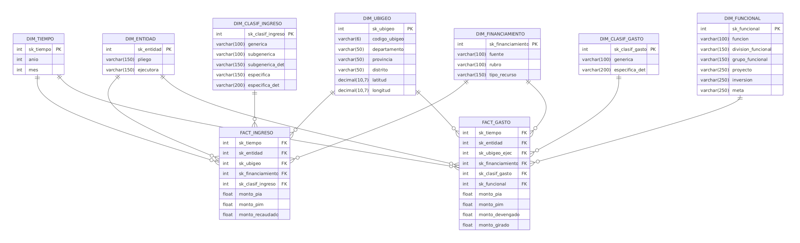

# BI_Budget_Intelligence_Peru
Large scale Budgeting Analysis Tool using open data from the Peruvian government's platform

## Integrantes:

* Abel Montes de Oca
* Rodrigo Bisetti
* María Mendoza
* Ximena Ramírez

# 1. Contexto

El presupuesto público del Perú se administra a través del SIAF, el sistema del Ministerio de Economía y Finanzas (MEF) donde más de 2,500 entidades entre pliegos, gobiernos regionales y locales registran su programación y ejecución. El proceso sigue el ciclo formal del gasto (PIA, PIM, devengado, girado) y del ingreso (recaudación), bajo el enfoque de Presupuesto por Resultados.

El MEF publica esta información como datos abiertos y a través de Consulta Amigable, pero en un formato pensado para el registro y la consulta puntual, no para el análisis comparativo. No hay una vista que permita ver, por ejemplo, cuánto recauda una región frente a lo que ejecuta.

La descentralización fiscal, vigente desde inicios de los 2000, multiplicó el número de unidades ejecutoras y con ello la heterogeneidad de la data. Este proyecto construye un datamart de inteligencia de negocios sobre la data abierta del MEF (año 2026, ámbito Proyectos de Inversión) para medir, comparar y explicar la ejecución presupuestal pública.

# 2. Descripción de la institución

El proyecto se construye sobre información del Ministerio de Economía y Finanzas del Perú (MEF), específicamente de la Dirección General de Presupuesto Público (DGPP), ente rector del presupuesto público. El MEF define los clasificadores oficiales de ingreso, gasto y clasificación funcional programática, y administra el SIAF, el sistema donde todas las entidades públicas registran su presupuesto.

Como mecanismo de transparencia, el MEF publica esta data a través de Consulta Amigable (`apps5.mineco.gob.pe/transparencia/Navegador`), la fuente usada en este proyecto para el año fiscal 2026, ámbito Proyecto. Ahí se puede consultar, por entidad, el PIA, el PIM, el devengado, el girado y el recaudado, desagregados por ubicación geográfica, fuente de financiamiento y clasificación funcional programática: exactamente las dimensiones sobre las que se construye este datamart.

El MEF no es una empresa privada, así que el "cliente" de esta solución se entiende en sentido amplio: funcionarios públicos, órganos de control y ciudadanos que hoy no cuentan con una herramienta que traduzca esta data en indicadores accionables.

# 3. Fuentes de datos

a) Presupuesto y Ejecución de Gasto. Fuente: Ministerio de Economía y Finanzas, Datos Abiertos. https://www.datosabiertos.gob.pe/dataset/presupuesto-y-ejecución-de-gasto

b) Presupuesto y Ejecución de Ingreso. Fuente: Ministerio de Economía y Finanzas, Datos Abiertos. https://www.datosabiertos.gob.pe/dataset/presupuesto-y-ejecución-de-ingreso

c) Tabla de Ubigeos del Perú al 2021. Fuente: Datos abiertos. https://www.datosabiertos.gob.pe/dataset/codigos-equivalentes-de-ubigeo-del-peru/resource/4a035ef3-8c50-4a4c-a11b-45a0777aedb3

Conversión y almacenamiento de datos: Los archivos (formato CSV) fueron transformados al formato Parquet mediante la biblioteca DuckDB en Python, con el objetivo de optimizar su almacenamiento y procesamiento. Los archivos resultantes se encuentran disponibles en el siguiente enlace de Google Drive: (https://drive.google.com/drive/folders/16SBvEmBFvqbuuqwO0WiikVK3rTC7Y7Pv?usp=sharing).

# 4. Problemática

Los datos que publica el MEF vienen en archivos planos separados por dataset: uno para ingreso, otro para gasto, otro para ubigeo. Cada uno usa sus propios códigos y nombres de columna, sin una llave común para cruzarlos. Esto obliga a limpiar y unir las tablas a mano antes de poder responder algo tan simple como cuánto ejecutó una entidad frente a lo presupuestado.

Consulta Amigable, la herramienta oficial del MEF, sí tiene un visualizador con dashboards, pero separa el gasto y el ingreso en módulos distintos. Se puede ver cuánto ejecutó una entidad o cuánto recaudó, pero no ambos cruzados en una misma vista, al nivel que uno elija (entidad, región, fuente de financiamiento, periodo). Para saber si una región gasta más de lo que recauda, o cómo cambia esa brecha en el tiempo, hay que consultar cada módulo por separado y cruzar los resultados manualmente.

Esto afecta tanto a funcionarios públicos, que necesitan comparar su ejecución con la de entidades similares, como a ciudadanos que quieren fiscalizar el gasto de su región sin cruzar reportes a mano. Ninguno de los dos puede hoy explorar el cruce ingreso gasto al nivel de detalle que necesita.

Este proyecto busca cubrir ese vacío: un modelo dimensional que integre ingreso, gasto y territorio en una sola estructura, listo para visualizar y comparar ambos lados del presupuesto a la granularidad que el usuario elija.

# 5. Objetivos

## Objetivo general

Diseñar e implementar una solución de almacenamiento y análisis de datos que integre la información de presupuesto y ejecución del gasto público peruano correspondiente al periodo *2023-2026*, utilizando archivos en formato Parquet y un modelo dimensional que facilite el análisis temporal, institucional, presupuestal y geográfico de los recursos públicos.

## Objetivos específicos

1. *Integrar y estandarizar* los conjuntos de datos de presupuesto y ejecución del gasto correspondientes a los años 2023, 2024, 2025 y 2026 provenientes de las fuentes de datos abiertos del MEF.

2. *Transformar y almacenar los datos en formato Parquet*, reduciendo las limitaciones asociadas al procesamiento de los archivos CSV originales y facilitando el acceso a las variables necesarias durante el procesamiento y análisis de la información.

3. *Diseñar e implementar un modelo dimensional* que organice la información mediante una tabla de hechos de ejecución del gasto y dimensiones asociadas al periodo, entidad, clasificación presupuestal, fuente de financiamiento y ubicación geográfica.

4. *Consolidar las principales métricas presupuestales* necesarias para el análisis, considerando el Presupuesto Institucional de Apertura (PIA), el Presupuesto Institucional Modificado (PIM), el monto devengado y el monto girado.

5. *Incorporar información geográfica mediante códigos UBIGEO, latitud y longitud*, permitiendo analizar territorialmente la ejecución presupuestal y desarrollar visualizaciones geográficas mediante mapas.

6. *Generar indicadores de ejecución presupuestal* que permitan comparar el presupuesto asignado y ejecutado, analizar su evolución entre 2023 y 2026 e identificar diferencias entre periodos, entidades y ámbitos territoriales.

7. *Desarrollar consultas y visualizaciones analíticas* que permitan explorar tendencias y patrones de la ejecución del gasto público desde perspectivas temporales, institucionales, presupuestales y geográficas.

# 6. Marco teórico

## 6.1 Business Intelligence y data warehousing

### 6.1.1 Business Intelligence

Conjunto de sistemas que combinan recolección, almacenamiento y gestión del conocimiento con herramientas analíticas, para presentar información compleja a quienes toman decisiones (Negash, 2004). En este proyecto, BI se aplica sobre la información presupuestal del MEF con fines comparativos.

### 6.1.2 Data warehouse

Colección de datos orientada a temas, integrada, no volátil y variante en el tiempo, que sirve de soporte a la toma de decisiones (Inmon, 2005). A diferencia de los sistemas transaccionales (OLTP), optimizados para registrar operaciones individuales, el data warehouse está diseñado para consultas analíticas sobre grandes volúmenes de datos históricos (Chaudhuri & Dayal, 1997).

### 6.1.3 Modelamiento dimensional

Organiza los datos en tablas de hechos, que guardan las mediciones numéricas de un proceso de negocio, y tablas de dimensiones, que dan el contexto de esas mediciones: quién, qué, dónde, cuándo y cómo (Kimball & Ross, 2013).

## 6.2 Presupuesto público del Perú

### 6.2.1 Sistema Nacional de Presupuesto Público

Conjunto de normas, procesos e instituciones que organiza cómo el Estado peruano asigna, ejecuta y evalúa sus recursos. Está regulado por el Decreto Legislativo N.° 1440, y su ente rector es la DGPP del MEF, encargada de fijar las reglas y clasificadores que todas las entidades deben aplicar (Decreto Legislativo N.° 1440, 2018).

### 6.2.2 Sistema Integrado de Administración Financiera (SIAF)

Sistema informático del MEF donde las entidades públicas registran la programación y ejecución de su presupuesto. Es el sistema transaccional de las finanzas públicas, y de ahí provienen los datos abiertos que publica el MEF.

### 6.2.3 Pliego y unidad ejecutora

El pliego es la entidad a la que se le aprueba un presupuesto: un ministerio, un gobierno regional, una municipalidad. La unidad ejecutora es la dependencia dentro del pliego que administra los recursos, y es el nivel más detallado en el que se registra la ejecución (Decreto Legislativo N.° 1440, 2018).

### 6.2.4 Presupuesto Institucional de Apertura (PIA)

Presupuesto aprobado para una entidad al inicio del año fiscal, tanto en ingresos como en gastos (Decreto Legislativo N.° 1440, 2018).

### 6.2.5 Presupuesto Institucional Modificado (PIM)

Presupuesto actualizado de una entidad, resultado de sumar al PIA las modificaciones aprobadas durante el año, como transferencias o créditos adicionales (Decreto Legislativo N.° 1440, 2018). Representa los recursos con los que la entidad realmente cuenta, por lo que es la referencia habitual para evaluar su gestión.

### 6.2.6 Devengado

Fase del gasto en la que se reconoce la obligación de pagar, una vez recibido conforme el bien o servicio. La precede la certificación (reserva del presupuesto) y el compromiso (acuerdo con el proveedor) (Decreto Legislativo N.° 1440, 2018). Se considera la medida estándar de ejecución, porque indica que el gasto ya se concretó.

### 6.2.7 Girado

Fase final del gasto, en la que se emite el pago y se cancela la obligación reconocida en el devengado.

### 6.2.8 Avance de ejecución

Indicador que mide qué proporción de su presupuesto ha gastado una entidad. Se calcula dividiendo el monto devengado entre el PIM.

### 6.2.9 Recaudado

Monto de ingresos que una entidad efectivamente percibe en un periodo, ya sea por impuestos, tasas, transferencias u otras fuentes.

### 6.2.10 Fuente de financiamiento y rubro

Categorías que identifican el origen de los recursos públicos. La fuente agrupa los recursos según su procedencia general (recursos ordinarios, recursos determinados), y el rubro la desagrega (canon y sobrecanon, regalías, renta de aduanas) (Decreto Legislativo N.° 1440, 2018).

### 6.2.11 Clasificadores económicos de ingresos y gastos

Catálogos jerárquicos del MEF que agrupan los ingresos según su naturaleza (impuestos, transferencias) y los gastos según el tipo de bien o servicio adquirido (planillas, bienes y servicios, obras).

### 6.2.12 Clasificación funcional y estructura programática

La clasificación funcional agrupa el gasto según las grandes áreas de acción del Estado: educación, salud, transporte. La estructura programática lo vincula con los programas presupuestales, productos y proyectos a los que se destina. Ambas convergen en la meta presupuestal, la unidad mínima de programación del gasto dentro de una entidad.

# 7. Modelamiento multidimensional

El modelo está compuesto por dos tablas de hechos: `FACT_INGRESO` y `FACT_GASTO`. Ambas comparten las dimensiones conformadas `DIM_TIEMPO`, `DIM_ENTIDAD`, `DIM_UBIGEO` y `DIM_FINANCIAMIENTO`, lo que permite comparar ingresos y gastos bajo un mismo contexto temporal, institucional, territorial y de fuente de financiamiento. Además, cada tabla de hechos se relaciona con dimensiones propias que describen la naturaleza económica, funcional y programática de los montos.

A continuación, se presenta la descripción de las tablas que conforman el modelo dimensional.

## Diccionario de datos

### DIM_TIEMPO
 
La dimensión tiempo almacena la información temporal asociada a los registros de ingreso y gasto. Su granularidad es mensual, en concordancia con la frecuencia de publicación de los datos del MEF, y permite realizar análisis de evolución y acumulados a lo largo del año fiscal. En el gasto corresponde al periodo de ejecución del presupuesto; en el ingreso, al periodo del documento de recaudación.
 
| Nombre de columna | Tipo de dato | Descripción |
|---|---|---|
| sk_tiempo | INT | Identificador único de la dimensión tiempo (clave subrogada). |
| anio | INT | Año de ejecución del presupuesto (gasto) o año del documento en que se realizó la recaudación (ingreso). Origen: `ANO_EJE` / `ANO_DOC`. |
| mes | INT | Mes de ejecución del presupuesto (gasto) o mes del documento de recaudación (ingreso), del 1 al 12. Origen: `MES_EJE` / `MES_DOC`. |
 
---
 
### DIM_ENTIDAD
 
La dimensión entidad almacena la información de las instituciones públicas que recaudan ingresos y ejecutan gasto. Su nivel de detalle es la unidad ejecutora, identificada por el MEF mediante un código secuencial único (`SEC_EJEC`), y se organiza jerárquicamente dentro de un pliego presupuestal.
 
| Nombre de columna | Tipo de dato | Descripción |
|---|---|---|
| sk_entidad | INT | Identificador único de la dimensión entidad (clave subrogada). Se genera a partir del código que identifica a la entidad. Origen: `SEC_EJEC`. |
| pliego | VARCHAR(150) | Descripción del pliego al que pertenece la entidad (por ejemplo, un ministerio, gobierno regional o municipalidad). Origen: `PLIEGO_NOMBRE`. |
| ejecutora | VARCHAR(150) | Nombre de la entidad o unidad ejecutora responsable de la recaudación o del gasto. Origen: `EJECUTORA_NOMBRE`. |
 
---
 
### DIM_UBIGEO
 
La dimensión ubigeo almacena la información geográfica del lugar donde se ubica la entidad, según la división político-administrativa del Perú.
 
| Nombre de columna | Tipo de dato | Descripción |
|---|---|---|
| sk_ubigeo | INT | Identificador único de la dimensión ubigeo (clave subrogada). |
| codigo_ubigeo | VARCHAR(6) | Código de Ubicación Geográfica (UBIGEO) del INEI que identifica de forma única al distrito donde se ubica la entidad, compuesto por los dos dígitos de departamento, dos de provincia y dos de distrito. |
| departamento | VARCHAR(50) | Nombre del departamento donde se ubica la entidad. Origen: `DEPARTAMENTO_EJECUTORA_NOMBRE`. |
| provincia | VARCHAR(50) | Nombre de la provincia del departamento donde se ubica la entidad. Origen: `PROVINCIA_EJECUTORA_NOMBRE`. |
| distrito | VARCHAR(50) | Nombre del distrito de la provincia del departamento donde se ubica la entidad. Origen: `DISTRITO_EJECUTORA_NOMBRE`. |
| latitud | VARCHAR(50) | Coordenada de latitud del distrito, expresada en grados decimales y asociada a `codigo_ubigeo`. |
| longitud | VARCHAR(50) | Coordenada de longitud del distrito, expresada en grados decimales y asociada a `codigo_ubigeo`.
---
 
### DIM_FINANCIAMIENTO
 
La dimensión financiamiento almacena el origen de los recursos públicos, organizado en tres niveles: fuente de financiamiento, rubro y tipo de recurso. Es una dimensión conformada que permite comparar, para un mismo rubro, cuánto se recaudó y cuánto se gastó.
 
| Nombre de columna | Tipo de dato | Descripción |
|---|---|---|
| sk_financiamiento | INT | Identificador único de la dimensión financiamiento (clave subrogada). |
| fuente | VARCHAR(100) | Descripción de la fuente de financiamiento, que agrupa a uno o más rubros (Recursos Ordinarios, Recursos Directamente Recaudados, Recursos por Operaciones Oficiales de Crédito, Donaciones y Transferencias, Recursos Determinados). Origen: `FUENTE_FINANCIAMIENTO_NOMBRE`. |
| rubro | VARCHAR(100) | Descripción del rubro que puede utilizar la entidad, es decir, de dónde provienen los recursos (por ejemplo, Canon y sobrecanon, regalías, renta de aduanas y participaciones). Origen: `RUBRO_NOMBRE`. |
| tipo_recurso | VARCHAR(150) | Descripción del tipo de recurso, que desagrega el rubro. Origen: `TIPO_RECURSO_NOMBRE`. |
 
---
 
### DIM_CLASIF_INGRESO
 
La dimensión clasificador de ingreso almacena la clasificación económica de los recursos que se recaudan, captan u obtienen, según el Clasificador de Ingresos del MEF. Permite identificar la naturaleza de cada ingreso, como impuestos, transferencias, endeudamiento o saldos de balance.
 
| Nombre de columna | Tipo de dato | Descripción |
|---|---|---|
| sk_clasif_ingreso | INT | Identificador único de la dimensión clasificador de ingreso (clave subrogada). |
| generica | VARCHAR(100) | Genérica de ingreso, el mayor nivel de agregación de los clasificadores de ingreso (por ejemplo, Impuestos y contribuciones obligatorias, Saldos de balance). Origen: `GENERICA_NOMBRE`. |
| subgenerica | VARCHAR(100) | Subgenérica de ingreso, nivel intermedio de desagregación que permite detallar la categoría de la genérica. Origen: `SUBGENERICA_NOMBRE`. |
| subgenerica_det | VARCHAR(150) | Subgenérica detalle de ingreso, nivel que desagrega la subgenérica y permite identificar con mayor precisión la naturaleza del ingreso. Origen: `SUBGENERICA_DET_NOMBRE`. |
| especifica | VARCHAR(150) | Específica de ingreso, nivel de clasificación que detalla la naturaleza del ingreso dentro de la subgenérica detalle. Origen: `ESPECIFICA_NOMBRE`. |
| especifica_det | VARCHAR(200) | Específica detalle, el nivel de agregación más específico y detallado que identifica y clasifica los recursos. Origen: `ESPECIFICA_DET_NOMBRE`. |
 
---
 
### DIM_CLASIF_GASTO
 
La dimensión clasificador de gasto almacena la clasificación económica del gasto según el Clasificador de Gastos del MEF. Permite identificar en qué se utilizan los recursos, como planillas, bienes y servicios o inversión en activos.
 
| Nombre de columna | Tipo de dato | Descripción |
|---|---|---|
| sk_clasif_gasto | INT | Identificador único de la dimensión clasificador de gasto (clave subrogada). |
| generica | VARCHAR(100) | Genérica de gasto, el mayor nivel de agregación de los clasificadores de gasto (por ejemplo, Personal y obligaciones sociales, Bienes y servicios, Adquisición de activos no financieros). Origen: `GENERICA_NOMBRE`. |
| subgenerica | VARCHAR(100) | Subgenérica de gasto, nivel intermedio de desagregación que permite detallar la categoría de la genérica. Origen: `SUBGENERICA_NOMBRE`. |
| subgenerica_det | VARCHAR(150) | Subgenérica detalle de gasto, nivel que desagrega la subgenérica y permite identificar con mayor precisión la naturaleza del gasto. Origen: `SUBGENERICA_DET_NOMBRE`. |
| especifica | VARCHAR(150) | Específica de gasto, nivel de clasificación que detalla la naturaleza del gasto dentro de la subgenérica detalle. Origen: `ESPECIFICA_NOMBRE`. |
| especifica_det | VARCHAR(200) | Específica de nivel 2, que identifica el detalle del gasto. Es el nivel más desagregado del clasificador. Origen: `ESPECIFICA_DET_NOMBRE`. |
 
---
 
### DIM_FUNCIONAL
 
La dimensión funcional almacena las metas presupuestales junto con su clasificación funcional y programática. Su granularidad es la meta, que es la unidad mínima de programación del gasto dentro de cada entidad y se identifica por la combinación de la entidad (`SEC_EJEC`) y el código de meta (`SEC_FUNC`).
 
Esta dimensión desnormaliza dos clasificaciones del gasto: la funcional (función → división funcional → grupo funcional) y la programática (producto o proyecto → actividad, acción de inversión u obra). Ambas se integran en una sola tabla porque convergen en la meta: según el MEF, cada meta corresponde a una combinación única de función, división funcional, grupo funcional, producto o proyecto y actividad, diferenciada por su finalidad.
 
| Nombre de columna | Tipo de dato | Descripción |
|---|---|---|
| sk_funcional | INT | Identificador único de la dimensión funcional (clave subrogada). Se genera a partir de la combinación de `SEC_EJEC` y `SEC_FUNC`. |
| funcion | VARCHAR(100) | Función, el nivel máximo de agregación de las acciones orientadas a la ejecución de un determinado tema (por ejemplo, Educación, Salud, Transporte). Origen: `FUNCION_NOMBRE`. |
| division_funcional | VARCHAR(150) | División funcional, el nivel intermedio de agregación de las acciones orientadas a la ejecución de un determinado tema. Origen: `DIVISION_FUNCIONAL_NOMBRE`. |
| grupo_funcional | VARCHAR(150) | Grupo funcional, el tercer y más desagregado nivel de la clasificación funcional. Origen: `GRUPO_FUNCIONAL_NOMBRE`. |
| proyecto | VARCHAR(250) | Descripción del producto o proyecto al que se destina el gasto. Origen: `PRODUCTO_PROYECTO_NOMBRE`. |
| inversion | VARCHAR(250) | Descripción de la actividad, acción de inversión u obra que se ejecuta. Origen: `ACTIVIDAD_ACCION_OBRA_NOMBRE`. |
| meta | VARCHAR(250) | Descripción de la finalidad de la meta presupuestal. Origen: `META_NOMBRE`. |
 
---
 
### FACT_INGRESO
 
La tabla de hechos de ingreso almacena los montos presupuestados y recaudados por las entidades públicas. Su granularidad es un registro por mes de documento, entidad, ubicación, fuente de financiamiento y clasificador de ingreso.
 
| Nombre de columna | Tipo de dato | Descripción |
|---|---|---|
| sk_tiempo | INT | Clave foránea a `DIM_TIEMPO`. Mes del documento en que se realizó la recaudación. |
| sk_entidad | INT | Clave foránea a `DIM_ENTIDAD`. Entidad que recauda el ingreso. |
| sk_ubigeo | INT | Clave foránea a `DIM_UBIGEO`. Ubicación de la entidad. |
| sk_financiamiento | INT | Clave foránea a `DIM_FINANCIAMIENTO`. Fuente, rubro y tipo de recurso del ingreso. |
| sk_clasif_ingreso | INT | Clave foránea a `DIM_CLASIF_INGRESO`. Clasificación económica del ingreso. |
| monto_pia | FLOAT | Monto asignado del Presupuesto Institucional de Apertura (PIA), en soles. Se registra íntegramente en el mes 1. Origen: `MONTO_PIA`. |
| monto_pim | FLOAT | Monto del Presupuesto Institucional Modificado (PIM), en soles. En el ingreso se registra como modificación del periodo, por lo que su suma acumulada equivale al PIM vigente. Origen: `MONTO_PIM`. |
| monto_recaudado | FLOAT | Monto total de la fase Recaudado, por año de documento, en soles. Origen: `MONTO_RECAUDADO`. |
 
---
 
### FACT_GASTO
 
La tabla de hechos de gasto almacena los montos presupuestados y ejecutados por las entidades públicas en sus distintas fases. Su granularidad es un registro por mes de ejecución, entidad, ubicación, fuente de financiamiento, clasificador de gasto y meta presupuestal.
 
| Nombre de columna | Tipo de dato | Descripción |
|---|---|---|
| sk_tiempo | INT | Clave foránea a `DIM_TIEMPO`. Mes de ejecución del presupuesto. |
| sk_entidad | INT | Clave foránea a `DIM_ENTIDAD`. Entidad que ejecuta el gasto. |
| sk_ubigeo_ejec | INT | Clave foránea a `DIM_UBIGEO`. Ubicación de la entidad que ejecuta el gasto. |
| sk_financiamiento | INT | Clave foránea a `DIM_FINANCIAMIENTO`. Fuente, rubro y tipo de recurso que financia el gasto. |
| sk_clasif_gasto | INT | Clave foránea a `DIM_CLASIF_GASTO`. Clasificación económica del gasto. |
| sk_funcional | INT | Clave foránea a `DIM_FUNCIONAL`. Meta presupuestal, con su clasificación funcional y programática. |
| monto_pia | FLOAT | Monto del Presupuesto Institucional de Apertura: presupuesto asignado inicialmente a la entidad al inicio del año fiscal, previo a cualquier modificación presupuestal. |
| monto_pim | FLOAT | Monto del Presupuesto Institucional Modificado (PIM), en soles. Se registra en el mes 0 (apertura) y refleja el presupuesto vigente tras las modificaciones del año. Origen: `MONTO_PIM`. |
| monto_devengado | FLOAT | Monto ejecutado en la fase Devengado, en soles: obligación de pago reconocida tras la conformidad del bien o servicio recibido. Es la medida estándar de ejecución del gasto. Origen: `MONTO_DEVENGADO`. |
| monto_girado | FLOAT | Monto ejecutado en la fase Girado, en soles: pago efectivamente emitido a favor del acreedor. Origen: `MONTO_GIRADO`. |

## Diseño del Data Warehouse

## Referencias

Chaudhuri, S., & Dayal, U. (1997). An overview of data warehousing and OLAP technology. *ACM SIGMOD Record, 26*(1), 65-74. https://doi.org/10.1145/248603.248616

Decreto Legislativo N.° 1440. (2018, 16 de septiembre). Decreto Legislativo del Sistema Nacional de Presupuesto Público. *Diario Oficial El Peruano*.

Inmon, W. H. (2005). *Building the data warehouse* (4.ª ed.). Wiley.

Kimball, R., & Ross, M. (2013). *The data warehouse toolkit: The definitive guide to dimensional modeling* (3.ª ed.). Wiley.

Negash, S. (2004). Business intelligence. *Communications of the Association for Information Systems, 13*, 177-195. https://doi.org/10.17705/1CAIS.01315
