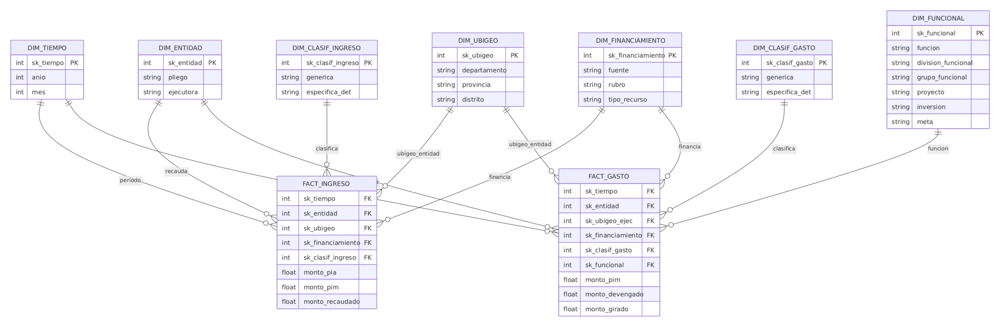

# BI_Budget_Intelligence_Peru
Large scale Budgeting Analysis Tool using open data from the Peruvian government's platform

## Integrantes:

* Abel Montes de Oca
* Rodrigo Bisetti
* María Mendoza
* Ximena Ramírez

# 1. Contexto
La gestión de las finanzas públicas en el Perú se organiza a través del **Sistema Integrado de Administración Financiera (SIAF)**, administrado por el Ministerio de Economía y Finanzas (MEF), que registra la programación y ejecución del presupuesto público de más de 2,500 entidades entre pliegos, gobiernos regionales y gobiernos locales a nivel nacional. Este proceso sigue el ciclo presupuestal formal (PIA, PIM, devengado y girado en el gasto; recaudación en el ingreso) y se enmarca en el enfoque de **Presupuesto por Resultados (PpR)**, que busca vincular la asignación de recursos con el logro de resultados medibles para la ciudadanía.

Como parte de su política de transparencia fiscal, el MEF publica esta información de forma abierta a través de plataformas como el **Navegador de Transparencia / Consulta Amigable** (`apps5.mineco.gob.pe/transparencia`), que permite consultar montos de ingreso y gasto por año, entidad, ubicación geográfica, fuente de financiamiento y clasificación funcional-programática. Sin embargo, esta data se publica en un formato pensado para el registro contable y la consulta puntual, y no para el análisis comparativo o la toma de decisiones a gran escala: no existe una vista consolidada que permita comparar, por ejemplo, cuánto recauda una región frente a cuánto ejecuta, o qué tan eficiente es una entidad respecto a otras con condiciones similares.

En este contexto, la descentralización fiscal peruana (vigente desde inicios de los 2000) ha ampliado el número de unidades ejecutoras responsables de gestionar presupuesto, lo que multiplica la heterogeneidad de la data y dificulta aún más su análisis agregado. Este proyecto propone construir un **datamart de inteligencia de negocios** sobre la data abierta del MEF (periodo 2026, ámbito de Proyectos de Inversión), con el fin de transformar los registros transaccionales del SIAF en un modelo dimensional que permita medir, comparar y explicar la ejecución presupuestal pública en el Perú.

# 2. Descripción de la institución
La institución sobre la cual se construye este proyecto es el **Ministerio de Economía y Finanzas del Perú (MEF)**, específicamente a través de la **Dirección General de Presupuesto Público (DGPP)**, ente rector del Sistema Nacional de Presupuesto Público. El MEF es responsable de diseñar la política presupuestal del país, definir los clasificadores oficiales de ingreso, gasto y clasificación funcional-programática, y administrar el SIAF como sistema transaccional en el que todas las entidades públicas, desde ministerios hasta municipalidades distritales, registran su programación y ejecución de presupuesto.

Como mecanismo de transparencia fiscal, el MEF expone esta información al público a través del portal **Navegador de Transparencia** (`https://apps5.mineco.gob.pe/transparencia/Navegador/default.aspx`), la fuente de datos utilizada en este proyecto (año fiscal 2026, ámbito "Proyecto"). Esta plataforma permite consultar, entidad por entidad, los montos de Presupuesto Institucional de Apertura (PIA), Presupuesto Institucional Modificado (PIM), devengado, girado y recaudado, desagregados por ubicación geográfica, fuente de financiamiento y clasificación funcional-programática, es decir, exactamente las dimensiones sobre las que se construye el modelo multidimensional del datamart (`DIM_TIEMPO`, `DIM_ENTIDAD`, `DIM_UBIGEO`, `DIM_FINANCIAMIENTO`, `DIM_CLASIF_INGRESO`, `DIM_CLASIF_GASTO`, `DIM_FUNCIONAL`).

Al ser el MEF el ente rector y no una empresa privada, el "cliente" de esta solución de BI se entiende en un sentido amplio: gestores públicos (a nivel de pliego, gobierno regional o municipalidad), órganos de control y ciudadanía interesada en fiscalizar el uso de recursos públicos, quienes hoy no cuentan con una herramienta analítica que traduzca la data abierta del MEF en indicadores de gestión accionables.

# 3. Fuentes de datos

a) Presupuesto y Ejecución de Gasto. Fuente: Ministerio de Economía y Finanzas, Datos Abiertos. https://www.datosabiertos.gob.pe/dataset/presupuesto-y-ejecución-de-gasto

b) Presupuesto y Ejecución de Ingreso. Fuente: Ministerio de Economía y Finanzas, Datos Abiertos. https://www.datosabiertos.gob.pe/dataset/presupuesto-y-ejecución-de-ingreso

c) Tabla de Ubigeos del Perú al 2021. Fuente: Datos abiertos. https://www.datosabiertos.gob.pe/dataset/codigos-equivalentes-de-ubigeo-del-peru/resource/4a035ef3-8c50-4a4c-a11b-45a0777aedb3

# 4. Problemática

# 5. Objetivos

## Objetivo general

## Objetivos específicos

# 6. Marco teórico

# 7. Modelamiento multidimensional

El modelo está compuesto por dos tablas de hechos: `FACT_INGRESO` y `FACT_GASTO`. Ambas comparten las dimensiones conformadas `DIM_TIEMPO`, `DIM_ENTIDAD`, `DIM_UBIGEO` y `DIM_FINANCIAMIENTO`, lo que permite comparar ingresos y gastos bajo un mismo contexto temporal, institucional, territorial y de fuente de financiamiento. Además, cada tabla de hechos se relaciona con dimensiones propias que describen la naturaleza económica, funcional y programática de los montos.

A continuación, se presenta la descripción de las tablas que conforman el modelo dimensional.

## Diccionario de datos

### DIM_TIEMPO
 
La dimensión tiempo almacena la información temporal asociada a los registros de ingreso y gasto. Su granularidad es mensual, en concordancia con la frecuencia de publicación de los datos del MEF, y permite realizar análisis de evolución y acumulados a lo largo del año fiscal. En el gasto corresponde al periodo de ejecución del presupuesto; en el ingreso, al periodo del documento de recaudación.
 
| Nombre de columna | Tipo de dato | Descripción |
|---|---|---|
| sk_tiempo | INT | Identificador único de la dimensión tiempo (clave subrogada). |
| anio | INT | Año de ejecución del presupuesto (gasto) o año del documento en que se realizó la recaudación (ingreso). Origen: `ANO_EJE` / `ANO_DOC`. |
| mes | INT | Mes de ejecución del presupuesto (gasto) o mes del documento de recaudación (ingreso), del 1 al 12. Origen: `MES_EJE` / `MES_DOC`. |
 
---
 
### DIM_ENTIDAD
 
La dimensión entidad almacena la información de las instituciones públicas que recaudan ingresos y ejecutan gasto. Su nivel de detalle es la unidad ejecutora, identificada por el MEF mediante un código secuencial único (`SEC_EJEC`), y se organiza jerárquicamente dentro de un pliego presupuestal.
 
| Nombre de columna | Tipo de dato | Descripción |
|---|---|---|
| sk_entidad | INT | Identificador único de la dimensión entidad (clave subrogada). Se genera a partir del código que identifica a la entidad. Origen: `SEC_EJEC`. |
| pliego | VARCHAR(150) | Descripción del pliego al que pertenece la entidad (por ejemplo, un ministerio, gobierno regional o municipalidad). Origen: `PLIEGO_NOMBRE`. |
| ejecutora | VARCHAR(150) | Nombre de la entidad o unidad ejecutora responsable de la recaudación o del gasto. Origen: `EJECUTORA_NOMBRE`. |
 
---
 
### DIM_UBIGEO
 
La dimensión ubigeo almacena la información geográfica del lugar donde se ubica la entidad, según la división político-administrativa del Perú.
 
| Nombre de columna | Tipo de dato | Descripción |
|---|---|---|
| sk_ubigeo | INT | Identificador único de la dimensión ubigeo (clave subrogada). |
| codigo_ubigeo | VARCHAR(6) | Código de Ubicación Geográfica (UBIGEO) del INEI que identifica de forma única al distrito donde se ubica la entidad, compuesto por los dos dígitos de departamento, dos de provincia y dos de distrito. |
| departamento | VARCHAR(50) | Nombre del departamento donde se ubica la entidad. Origen: `DEPARTAMENTO_EJECUTORA_NOMBRE`. |
| provincia | VARCHAR(50) | Nombre de la provincia del departamento donde se ubica la entidad. Origen: `PROVINCIA_EJECUTORA_NOMBRE`. |
| distrito | VARCHAR(50) | Nombre del distrito de la provincia del departamento donde se ubica la entidad. Origen: `DISTRITO_EJECUTORA_NOMBRE`. |
| latitud | VARCHAR(50) | Coordenada de latitud del distrito, expresada en grados decimales y asociada a `codigo_ubigeo`. |
| longitud | VARCHAR(50) | Coordenada de longitud del distrito, expresada en grados decimales y asociada a `codigo_ubigeo`.
---
 
### DIM_FINANCIAMIENTO
 
La dimensión financiamiento almacena el origen de los recursos públicos, organizado en tres niveles: fuente de financiamiento, rubro y tipo de recurso. Es una dimensión conformada que permite comparar, para un mismo rubro, cuánto se recaudó y cuánto se gastó.
 
| Nombre de columna | Tipo de dato | Descripción |
|---|---|---|
| sk_financiamiento | INT | Identificador único de la dimensión financiamiento (clave subrogada). |
| fuente | VARCHAR(100) | Descripción de la fuente de financiamiento, que agrupa a uno o más rubros (Recursos Ordinarios, Recursos Directamente Recaudados, Recursos por Operaciones Oficiales de Crédito, Donaciones y Transferencias, Recursos Determinados). Origen: `FUENTE_FINANCIAMIENTO_NOMBRE`. |
| rubro | VARCHAR(100) | Descripción del rubro que puede utilizar la entidad, es decir, de dónde provienen los recursos (por ejemplo, Canon y sobrecanon, regalías, renta de aduanas y participaciones). Origen: `RUBRO_NOMBRE`. |
| tipo_recurso | VARCHAR(150) | Descripción del tipo de recurso, que desagrega el rubro. Origen: `TIPO_RECURSO_NOMBRE`. |
 
---
 
### DIM_CLASIF_INGRESO
 
La dimensión clasificador de ingreso almacena la clasificación económica de los recursos que se recaudan, captan u obtienen, según el Clasificador de Ingresos del MEF. Permite identificar la naturaleza de cada ingreso, como impuestos, transferencias, endeudamiento o saldos de balance.
 
| Nombre de columna | Tipo de dato | Descripción |
|---|---|---|
| sk_clasif_ingreso | INT | Identificador único de la dimensión clasificador de ingreso (clave subrogada). Se genera a partir de la combinación de los códigos de genérica, subgenérica, subgenérica detalle, específica y específica detalle. |
| generica | VARCHAR(100) | Genérica de ingreso, el mayor nivel de agregación de los clasificadores de ingreso (por ejemplo, Impuestos y contribuciones obligatorias, Saldos de balance). Origen: `GENERICA_NOMBRE`. |
| especifica_det | VARCHAR(200) | Específica detalle, el nivel de agregación más específico y detallado que identifica y clasifica los recursos. Origen: `ESPECIFICA_DET_NOMBRE`. |
 
---
 
### DIM_CLASIF_GASTO
 
La dimensión clasificador de gasto almacena la clasificación económica del gasto según el Clasificador de Gastos del MEF. Permite identificar en qué se utilizan los recursos, como planillas, bienes y servicios o inversión en activos.
 
| Nombre de columna | Tipo de dato | Descripción |
|---|---|---|
| sk_clasif_gasto | INT | Identificador único de la dimensión clasificador de gasto (clave subrogada). Se genera a partir de la combinación de los códigos de genérica, subgenérica, subgenérica detalle, específica y específica detalle. |
| generica | VARCHAR(100) | Genérica de gasto, el mayor nivel de agregación de los clasificadores de gasto (por ejemplo, Personal y obligaciones sociales, Bienes y servicios, Adquisición de activos no financieros). Origen: `GENERICA_NOMBRE`. |
| especifica_det | VARCHAR(200) | Específica de nivel 2, que identifica el detalle del gasto. Es el nivel más desagregado del clasificador. Origen: `ESPECIFICA_DET_NOMBRE`. |
 
---
 
### DIM_FUNCIONAL
 
La dimensión funcional almacena las metas presupuestales junto con su clasificación funcional y programática. Su granularidad es la meta, que es la unidad mínima de programación del gasto dentro de cada entidad y se identifica por la combinación de la entidad (`SEC_EJEC`) y el código de meta (`SEC_FUNC`).
 
Esta dimensión desnormaliza dos clasificaciones del gasto: la funcional (función → división funcional → grupo funcional) y la programática (producto o proyecto → actividad, acción de inversión u obra). Ambas se integran en una sola tabla porque convergen en la meta: según el MEF, cada meta corresponde a una combinación única de función, división funcional, grupo funcional, producto o proyecto y actividad, diferenciada por su finalidad.
 
| Nombre de columna | Tipo de dato | Descripción |
|---|---|---|
| sk_funcional | INT | Identificador único de la dimensión funcional (clave subrogada). Se genera a partir de la combinación de `SEC_EJEC` y `SEC_FUNC`. |
| funcion | VARCHAR(100) | Función, el nivel máximo de agregación de las acciones orientadas a la ejecución de un determinado tema (por ejemplo, Educación, Salud, Transporte). Origen: `FUNCION_NOMBRE`. |
| division_funcional | VARCHAR(150) | División funcional, el nivel intermedio de agregación de las acciones orientadas a la ejecución de un determinado tema. Origen: `DIVISION_FUNCIONAL_NOMBRE`. |
| grupo_funcional | VARCHAR(150) | Grupo funcional, el tercer y más desagregado nivel de la clasificación funcional. Origen: `GRUPO_FUNCIONAL_NOMBRE`. |
| proyecto | VARCHAR(250) | Descripción del producto o proyecto al que se destina el gasto. Origen: `PRODUCTO_PROYECTO_NOMBRE`. |
| inversion | VARCHAR(250) | Descripción de la actividad, acción de inversión u obra que se ejecuta. Origen: `ACTIVIDAD_ACCION_OBRA_NOMBRE`. |
| meta | VARCHAR(250) | Descripción de la finalidad de la meta presupuestal. Origen: `META_NOMBRE`. |
 
---
 
### FACT_INGRESO
 
La tabla de hechos de ingreso almacena los montos presupuestados y recaudados por las entidades públicas. Su granularidad es un registro por mes de documento, entidad, ubicación, fuente de financiamiento y clasificador de ingreso.
 
| Nombre de columna | Tipo de dato | Descripción |
|---|---|---|
| sk_tiempo | INT | Clave foránea a `DIM_TIEMPO`. Mes del documento en que se realizó la recaudación. |
| sk_entidad | INT | Clave foránea a `DIM_ENTIDAD`. Entidad que recauda el ingreso. |
| sk_ubigeo | INT | Clave foránea a `DIM_UBIGEO`. Ubicación de la entidad. |
| sk_financiamiento | INT | Clave foránea a `DIM_FINANCIAMIENTO`. Fuente, rubro y tipo de recurso del ingreso. |
| sk_clasif_ingreso | INT | Clave foránea a `DIM_CLASIF_INGRESO`. Clasificación económica del ingreso. |
| monto_pia | FLOAT | Monto asignado del Presupuesto Institucional de Apertura (PIA), en soles. Se registra íntegramente en el mes 1. Origen: `MONTO_PIA`. |
| monto_pim | FLOAT | Monto del Presupuesto Institucional Modificado (PIM), en soles. En el ingreso se registra como modificación del periodo, por lo que su suma acumulada equivale al PIM vigente. Origen: `MONTO_PIM`. |
| monto_recaudado | FLOAT | Monto total de la fase Recaudado, por año de documento, en soles. Origen: `MONTO_RECAUDADO`. |
 
---
 
### FACT_GASTO
 
La tabla de hechos de gasto almacena los montos presupuestados y ejecutados por las entidades públicas en sus distintas fases. Su granularidad es un registro por mes de ejecución, entidad, ubicación, fuente de financiamiento, clasificador de gasto y meta presupuestal.
 
| Nombre de columna | Tipo de dato | Descripción |
|---|---|---|
| sk_tiempo | INT | Clave foránea a `DIM_TIEMPO`. Mes de ejecución del presupuesto. |
| sk_entidad | INT | Clave foránea a `DIM_ENTIDAD`. Entidad que ejecuta el gasto. |
| sk_ubigeo_ejec | INT | Clave foránea a `DIM_UBIGEO`. Ubicación de la entidad que ejecuta el gasto. |
| sk_financiamiento | INT | Clave foránea a `DIM_FINANCIAMIENTO`. Fuente, rubro y tipo de recurso que financia el gasto. |
| sk_clasif_gasto | INT | Clave foránea a `DIM_CLASIF_GASTO`. Clasificación económica del gasto. |
| sk_funcional | INT | Clave foránea a `DIM_FUNCIONAL`. Meta presupuestal, con su clasificación funcional y programática. |
| monto_pia | FLOAT | Monto del Presupuesto Institucional de Apertura: presupuesto asignado inicialmente a la entidad al inicio del año fiscal, previo a cualquier modificación presupuestal. |
| monto_pim | FLOAT | Monto del Presupuesto Institucional Modificado (PIM), en soles. Se registra en el mes 0 (apertura) y refleja el presupuesto vigente tras las modificaciones del año. Origen: `MONTO_PIM`. |
| monto_devengado | FLOAT | Monto ejecutado en la fase Devengado, en soles: obligación de pago reconocida tras la conformidad del bien o servicio recibido. Es la medida estándar de ejecución del gasto. Origen: `MONTO_DEVENGADO`. |
| monto_girado | FLOAT | Monto ejecutado en la fase Girado, en soles: pago efectivamente emitido a favor del acreedor. Origen: `MONTO_GIRADO`. |

## Diseño del Data Warehouse

